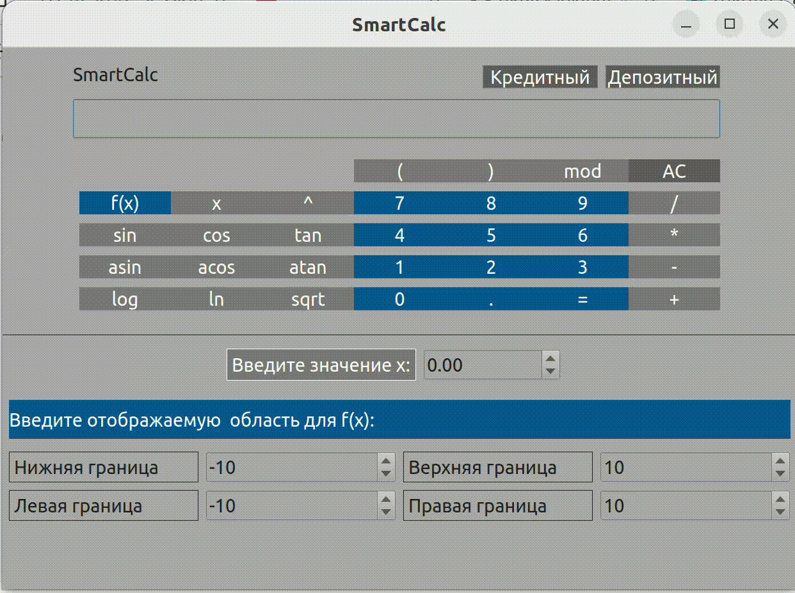
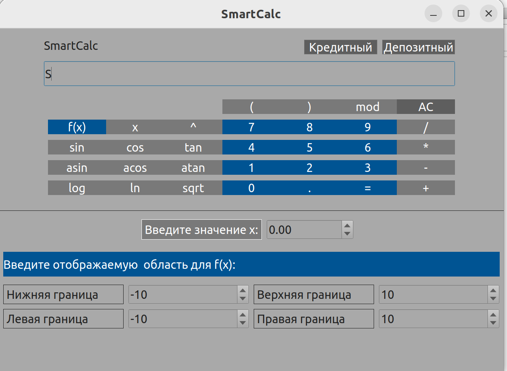
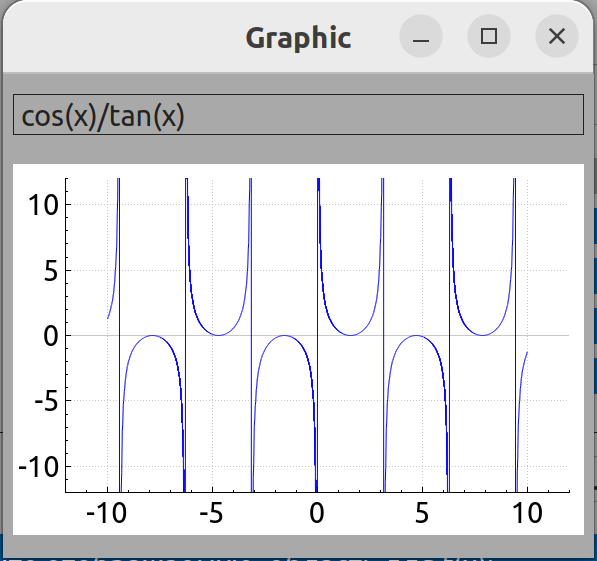
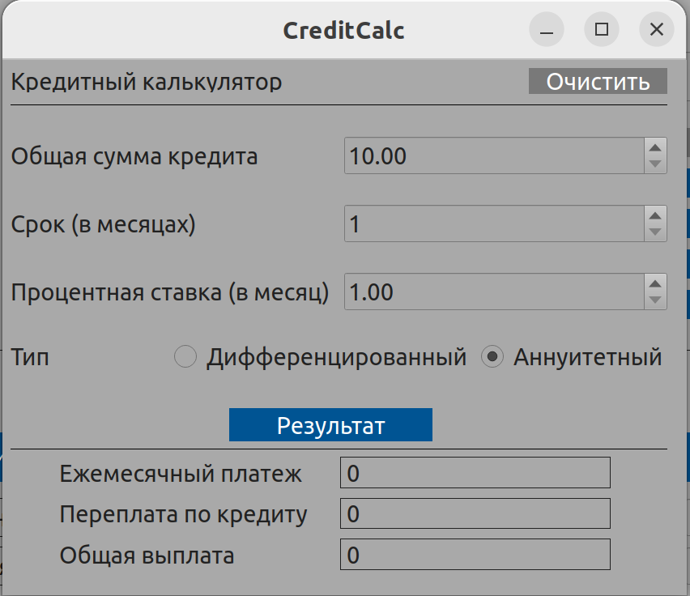
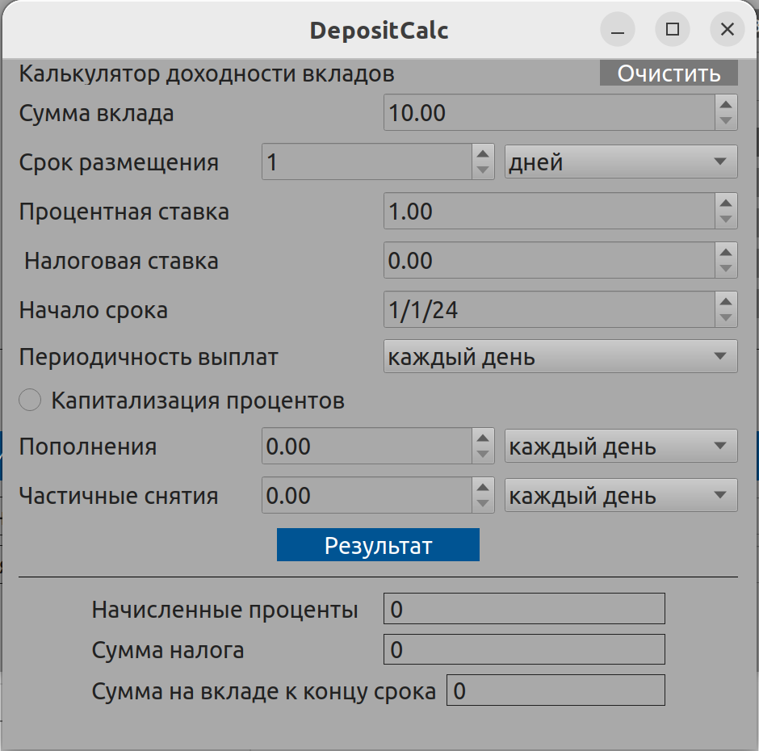

# :heavy_plus_sign: :heavy_multiplication_x: :heavy_minus_sign: :heavy_division_sign: Программа "SmartCalc"

 

## 1. Назначение программы

Данная программа предназаначена для выполнения **следующих функций**:

- вычисление произвольных скобочных арифметических выражений в инфиксной нотации;
- вычисление произвольных скобочных арифметических выражений в инфиксной нотации с подстановкой значения переменной x в виде числа;
- построение графика функции, заданной с помощью выражения в инфиксной нотации с переменной x.

В качестве специального режима реализован **"кредитный калькулятор"**, который на основе входных данных (общая сумма кредита, срок, процентная ставка, тип (аннуитетный, дифференцированный)) вычисляет:

- ежемесячный платеж;
- переплату по кредиту; 
- общую выплату.

В качестве специального режима реализован **"калькулятор доходности вкладов"**, который на основе входных данных (сумма вклада, срок размещения, процентная ставка, налоговая ставка, периодичность выплат, капитализация процентов, список пополнений, список частичных снятий) вычисляет:

- начисленные проценты;
- сумма налога;
- сумма на вкладе к концу срока.

 

Демонстрация работы некоторой функциональности калькулятора 

## 2. Условия выполнения программы

- Операционная система - **MacOS**, **Linux**.

## 3. Выполнение программы

### Для выполнения программы требуется установить ее. Это можно сделать, выполнив следующую последовательность действий:

- Необходимо ввести **make install** в командной строке в рабочем каталоге **../CPP3_SmartCalc_v2.0-1/src** и нажать **Enter**;
- После загрузки перейти в созданный каталог **build**;
- Открыть приложение **"SmartCalc"**.

### Для завершения работы программы нажать красную кнопку с крестиком на верхней панели приложения. Для удаления приложения:

- Необходимо ввести **make uninstall** в командной строке в рабочем каталоге **../CPP3_SmartCalc_v2.0-1/src** и нажать **Enter**;
- Далее ввести **make clean** в командной строке в рабочем каталоге **../CPP3_SmartCalc_v2.0-1/src** и нажать **Enter**.

### Для помещения компонентов программы в архив:

- Необходимо ввести **make dist** в командной строке в рабочем каталоге **../CPP3_SmartCalc_v2.0-1/src** и нажать **Enter**.

### Выполнение функций:

- *вычисление произвольных скобочных арифметических выражений в инфиксной нотации*.

Ввод доступен с клавиатуры в текстовое поле в ручную или с использованием доступных текстовых кнопок. Для вывода ответа на введенное арифметическое выражение требуется нажать командную кнопку "=". 
Для очистки текстового поля необходимо нажать командную кнопку "AC".

 

- *вычисление произвольных скобочных арифметических выражений в инфиксной нотации с подстановкой значения переменной x в виде числа*.

Для ввода х в основное текстовое поле - нажать на командную кнопку с "x". Для указания значения х необходимо ввести требуемое значение в поле после текста "Введите значение х:". Иначе, стандартное значение х - это 0. 

Ввод доступен с клавиатуры в текстовое поле в ручную или с использованием доступных текстовых кнопок. Для вывода ответа на введенное арифметическое выражение требуется нажать командную кнопку "=". Для очистки текстового поля необходимо нажать командную кнопку "AC".

 

- *построение графика функции, заданной с помощью выражения в инфиксной нотации с переменной x*.

Для указания отображаемой области значений и определений для графика необходимо ввести соответсвующие значения после текстов: "Нижняя граница", "Верхняя граница", "Левая граница", "Правая граница" и "Введите отображаемую область значения и определения для графика f(x):". Иначе, стандартными значениями будут, соотвественно, -10 10 -10 10.

Ввод доступен с клавиатуры в требуемое текстовое поле в ручную или с использованием доступных текстовых кнопок. 

Для вывода построения графика требуется нажать командную кнопку "f(x)". Для очистки текстового поля необходимо нажать командную кнопку "AC". После нажатия "f(x)", откроется новая страница с требуемым графиком функции с отображаемой области.

 

- "кредитный калькулятор"

Для перехода в данный режим необходимо нажать командную кнопку "Кредитный" в верхнем левом углу главной страницы. Откроется новая страница. 

Для получения результата необходимо ввести в поля "Общая сумма кредита", "Срок (в месяц)", "Процентная ставка (в месяц)" данные. Ввод доступен с клавиатуры в требуемое текстовое поле в ручную или с использованием доступных опций при работе с данными элементами графического интерфейса. Для вывода результата требуется нажать командную кнопку "Результат". Для очистки текстового поля необходимо нажать командную кнопку "AC".

 

- "кредитный доходности вкладов"

Для перехода в данный режим необходимо нажать командную кнопку "Депозитный" в верхнем левом углу главной страницы. Откроется новая страница. Для получения результата необходимо ввести в поля "Сумма вклада", "Срок размещения", "Процентная ставка" данные. При необходимости можно ввести фиксированное количество пополнений и частичных снятий и их периодичность. 

Ввод доступен с клавиатуры в требуемое текстовое поле в ручную или с использованием доступных опций при работе с данными элементами графического интерфейса. Для выбора требуемого результата из выпадающего списка требуется нажать на него и выбрать требуемый элемент. Для указания капитализации процентов нажать на кнопку около данного текста. Для вывода результата требуется нажать командную кнопку "Результат". Для очистки текстового поля необходимо нажать командную кнопку "AC".

## 4. Ошибки

Если произошла ошибка при:

- некорректном вводе арифметического выражения;
- ошибках в результате вычислениях (например, деление на 0);
и т.д., на экране появиться надпись "Error".

## 5. Графический интерфейс

 Графический интерфейс главного экрана калькулятора 

 Графический интерфейс окна с графиками 

 Графический интерфейс окна с кредитным калькулятором 

 Графический интерфейс окна с депозитным калькулятором 
